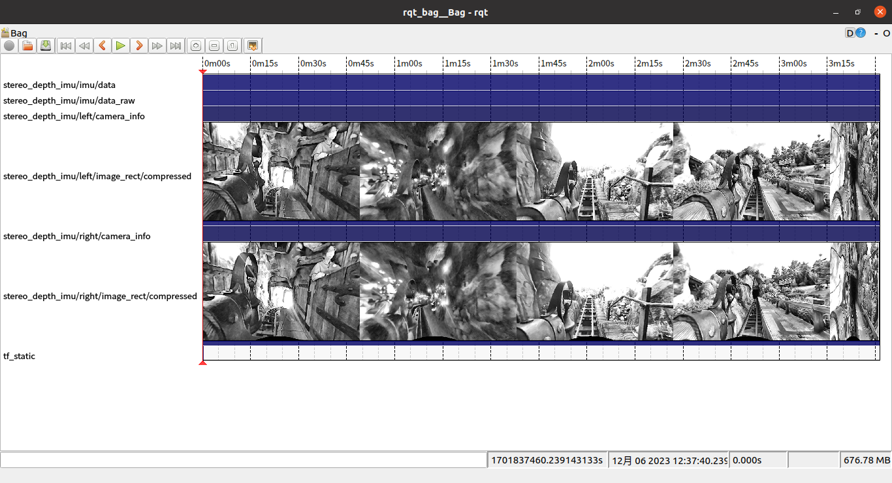

# Seven Dwarfs Mine Train


Roller Coaster DataBase: https://rcdb.com/11646.htm

Wikipedia: https://en.wikipedia.org/wiki/Seven_Dwarfs_Mine_Train

## Data Sequence

### seven_dwarfs_2023-12-06
* Format: rosbag
* Download Link:

    https://drive.google.com/file/d/1OeBAn9njlvL0wncRNhQH64P3d77D3CZo/view?usp=sharing

    or

    https://pan.baidu.com/s/1aqgNfX9Jtt5LOJnTy1Cv9A?pwd=0000
* Preview:

* Recording Device: [OAK-D Pro W](https://docs.luxonis.com/projects/hardware/en/latest/pages/DM9098prow/)
* Outputs: Stereo (640×400 @ 30 FPS) + IMU (BMI270 @ 100 Hz)
* Allan Variance of BMI270:
```yaml
    accelerometer_noise_density: 0.01 # [ m / s^2 / sqrt(Hz) ]
    accelerometer_random_walk: 0.001 # [ m / s^3 / sqrt(Hz) ]
    gyroscope_noise_density: 0.001 # [ rad / s / sqrt(Hz) ]
    gyroscope_random_walk: 0.0001 # [ rad / s^2 / sqrt(Hz) ]
```
* Intrinsics and Extrinsics: See 'camera_info' and 'tf_static' topics
* Same Boarding and Alighting points: False
* Note: Due to the driver issue, the IMU timestamp has an offset of approximately 0.01 ms